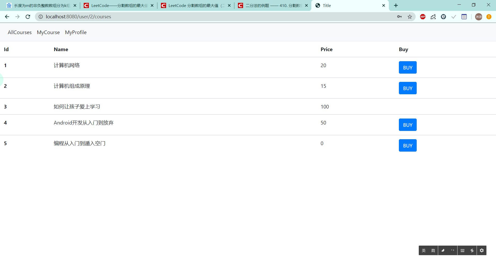

# Introduction

A minimal e-learning system.

Back-end:

- Spring Boot
- Spring Security
- Hibernate
- MySQL

Front-end:

- Thymeleaf

- Bootstrap

	# Feature

	## Security

	Based on Spring Security. And I set a token expire time to make sure a session will automatically time out.

	## Management

	Admin could modify courses’ price and delete courses. Meanwhile, admin can see all users.

	## Test

	I use Spring Test and JUnit to test my CRUD methods.

# Screenshots

## Authentication

## Welcome

### Admin

### User

## Course Management

## Courses

### All Course

### My Course

## My Profile

